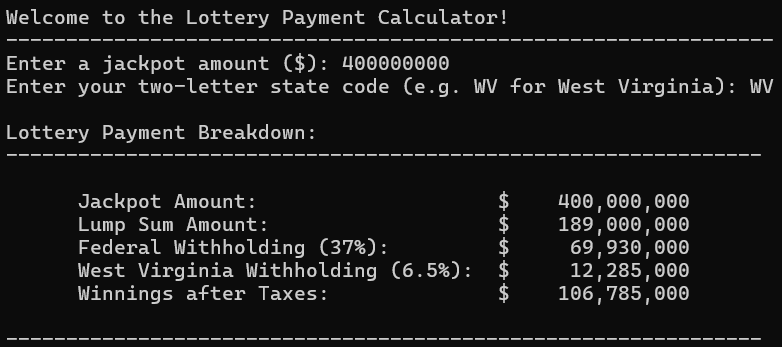
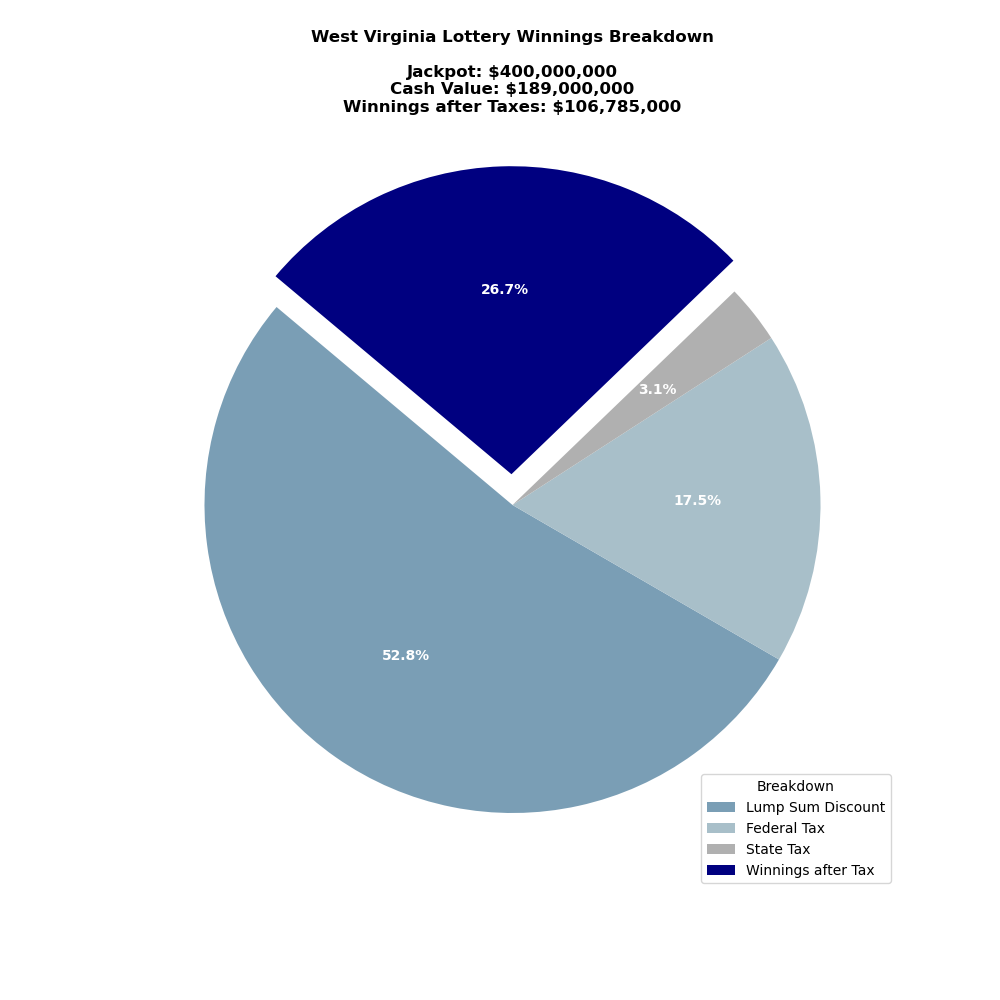

# Lottery Winnings Calculator

## Introduction
Since I was 18 years old, I have enjoyed testing my luck at playing the lottery. The thought of winning the lottery and retiring early sounds like a dream come true for many. However, winning the lottery involves more than just seeing your numbers being drawn; it requires an understanding of the financial impacts that comes with it. The chances of winning the Powerball, for example, is roughly 1 out of 292 million. Yet, if fortune does smile upon me, a significant portion of the winnings would need to go to Uncle Sam's and Brother Jonathan's pocket.

## Background

This project explores how much a lottery winner may walk away with after the lump sum and taxes are taken out. By using Python to estimate the lump sum, federal taxes, and state taxes of lottery winnings, the projram will provide valuable insights into actual earnings to help illustrate the importance of financial awareness and planning.

## Tools I Used

* <b> Python </b> - the foundation of my project, used for data extraction via API requests, data cleaning, and visualization.
* <b> Matplotlib </b> - the library used to create the supplimentary pie chart.
* <b> VSCode </b> - the code editor for developing and managing the project environment.
* <b> Terminal </b> - used for direct script execution and environment control to ensure seamless interaction between the code and system.
* <b> Git and Github </b> - Essential for version control, project tracking, and collaboration.

## The Analysis

```Python
import matplotlib.pyplot as plt
from state_taxes import lottery_tax_rates
import os
os.environ['QT_LOGGING_RULES'] = '*.debug=false;qt.qpa.*=false'

# Define lottery calculation parameters
def calculate_lottery_payments(jackpot, state_tax):
    lump_sum_percentage = 0.4725
    lump_sum = jackpot * lump_sum_percentage
    federal_withholding_percentage = 0.37
    federal_withholding = lump_sum * federal_withholding_percentage
    state_witholding = lump_sum * state_tax
    return lump_sum - federal_withholding - state_witholding

# Custom autopct to prevent rounding errors
def make_autopct(values):
    def autopct(pct):
        return f'{pct:.1f}%'
    return autopct

# Program execution

print() # For formatting only
print("Welcome to the Lottery Payment Calculator!")
print("=" * 63)

while True:
    try:
        j = float(input('Enter a jackpot amount ($): '))
        
        # Validate jackpot amount
        if j <= 0:
            print('The jackpot amount must be greater than 0. Please try again.')
            continue
        else:
            while True:
                state_code = input('Enter your two-letter state code (e.g. WV for West Virginia): ').strip().upper()
                if state_code not in lottery_tax_rates:
                    print('Invalid state code. Please try again.')
                    print('') # For formatting only
                elif lottery_tax_rates[state_code]['rate_pct'] is None:
                    print(f'{lottery_tax_rates[state_code]["name"]} does not allow lottery play. Please try again.')
                    print('') # For formatting only
                else:
                    s = lottery_tax_rates[state_code]['rate_pct'] / 100
                    payout = calculate_lottery_payments(j, s)
                    break
            break  # Exit the main loop after valid state code is entered
    
    except ValueError:
        print('Invalid input. Please enter a numeric value for the jackpot amount.')
        continue

# Statement Variables
lump_sum = 0.4725
federal_tax = 0.37

l = j * lump_sum
f = l * federal_tax
st = l * s

# Output calculations:
print(' ') # For formatting only
print('Lottery Payment Breakdown:')
print('=' * 63)
print(f"""
      {'Jackpot Amount:':<35}${j:>15,.0f}
      {'Lump Sum Amount:':<35}${l:>15,.0f}
      {'Federal Withholding (37%):':<35}${f:>15,.0f}
      {f'{lottery_tax_rates[state_code]["name"]} Withholding ({lottery_tax_rates[state_code]["rate_pct"]}%):':<35}${st:>15,.0f}
      {'Winnings after Taxes:':<35}${payout:>15,.0f}
        """)

print('=' * 63)

# Output Visual of Lottery Calculation Breakdowns

# Pie chart data
lump_sum_discount = j - l

labels     = ['Lump Sum Discount', 'Federal Tax', 'State Tax', 'Winnings after Tax']
categories = [lump_sum_discount, f, st, payout]
colors     = ['#7A9EB5','#A8BFC9','#B0B0B0','#000080']

# Filter out zero-value slices (e.g. states with 0% tax)
filtered = [(la, ca, co) for la, ca, co in zip(labels, categories, colors) if ca > 0]
labels_f, categories_f, colors_f = zip(*filtered)

# Dynamic explode — only pops the Winnings after Tax slice
explode = tuple(0.1 if la == 'Winnings after Tax' else 0 for la in labels_f)

# Build chart
plt.figure(figsize=(10, 10))
plt.pie(categories_f, colors=colors_f, explode=explode, autopct=make_autopct(categories_f),
        textprops={'weight': 'bold', 'color': 'white'}, startangle=140)
plt.title(f'{lottery_tax_rates[state_code]["name"]} Lottery Winnings Breakdown\n\nJackpot: ${j:,.0f}\nCash Value: ${l:,.0f}\nWinnings after Taxes: ${payout:,.0f}',
          fontweight='bold')
plt.legend(labels_f, title='Breakdown', loc='lower right')
plt.show()
```
The project was designed to focus on simplicity, user control, and security. The program follows a protocol with a clear sequence of operations to ensure understanding potential tax payments from winning the lottery:
* <b> User Input </b>: Prompts the user to enter a monetary jackpot amount and specify their state residency.
* <b> Calculation </b>: Utilizes a defined function to compute the lump-sum payout as well as federal and state tax deductions.
* <b> Input Validation </b>: Impliments error handling to detect invalid entries such as non-numeric jackpot inputs or states that do not permit lottery play.
* <b> Program Flow </b>: Operates in a continuous loop, allowing the program to reset and prompt for new inputs until all valid parameters are provided and the calculation is executed successfully.
* <b> Visualization </b>: Program provides a visualization on what percentage of winnings are received after all deductions and taxes

### Project Output Example:

<b> Lottery Payout Example for West Virginia </b>




The above example creates a lottery payment scenario based on someone who lives in West Virginia. The following information was observed:

1. For West Virginia, the majority of the lottery jackpot is deducted: <br>
    a. Lump Sum Discount - 52.8% <br>
    b. Federal Tax Deduction - 17.5% <br>
    c. State Tax Deduction - 3.1% <br>
    d. Total Deductions - 73.3% <br>
2. A West Virginia resident is expected to walk away with 26.7% of the jackpot

Despite the winner walking away with significantly less money than the advertised jackpot, the person still is a millionaire at the end of the day.

## Conclusion

This simple yet effective lottery enables a user to calculate their estimated winnings after taxes based on their state residency. By combining user input validation with clear logic, the program may be an accessible tool for financial implications of lottery winnings.

Future improvements to this project may include:
* Allowing users to choose between lump-sum or annuity payout methods
* Displaying visual breakdowns on lump-sum amounts, taxes, and other additional expenses (e.g. legal or advisory fees)
* Generating an annuity payment schedule for users that would like to see thier installment-based payouts
* Incorporating real-time API connections to display up-to-date lottery jackpots and tax rates for accurate, real-world analyses
